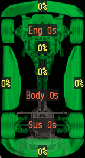
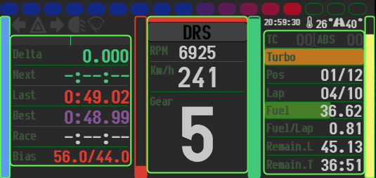

# Assetto Corsa Lua Applications

   

## [Lien Discord SRA](https://discord.gg/zGwTtpCqCF)

### Bienvenue dans mes applications Lua pour Assetto Corsa. 
>Ce projet vise à fournir diverses applications Lua utiles pour améliorer l'expérience de jeu sur Assetto Corsa.
>
>Il s'agit d'applications faites pour moi et que je partage librement.

## sra_tyres
**Application de statut des pneus et plus.**
<ul>

<li>Température des pneus (optimum)</li>
<li>Pression des pneus (optimum)</li>
<li>Usure des pneus</li>
<li>Charge des pneus</li>
<li>Plat des pneus</li>
<li>Graining des pneus</li>
<li>Blistering des pneus</li>
<li>Pincement des roues (ToeIn)</li>
<li>Carrossage des roues (Camber)</li>
<li>Température des disques si disponible</li>
<li>Affichage de roue qui glisses ou patines, l'extérieur du pneu devient orange</li>
<li>Affichage du blocage de roue , l'intérieur du pneu devient blanc</li>
<li>Options et zoom disponible</li>
</ul>

_* Ne fonctionne pas pour les autres voitures._

## sra_radar
**Application radar.**
<ul>

<li>Portée du radar : 25 mètres</li>
<li>Premier cercle : à 4 mètres du centre du radar</li>
<li>Deuxieme cercle : à 7 mètres du centre du radar</li>
<li>troisième cercle : à 10 mètres du centre du radar</li>
<li>Echelle des voitures respectée</li>
<li>Désactivé dans les stands</li>
<li>Les voitures aux stands n'activent pas le radar</li>
<li>Les voitures situées au-dessus ou en dessous (comme sur des ponts) n'activent pas le radar.</li>
<li>Affichage de la position de course</li>
<li>Sonar activé dans un rayon de 7 mètres</li>
<li>Message sonore pour signaler les voitures dans les angles morts</li>
<li>Redimensionnement de la fenêtre pour ajuster la taille du radar (fonction zoom)</li>
<li>Clic droit sur la fenêtre pour "Pin Window" afin de la fixer à l'écran</li>
<li>Options disponibles pour personnaliser les paramètres.</li>
</ul>

## sra_damage

**Application de statut des dégats.**
<ul>
<li>Dégat Moteur</li>
<li> Dégat Boite</li>
<li>Dégat avant / arrière</li>
<li>Dégat droit / gauche</li>
<li>Dégat Plat de pneu</li>
<li>Dégat Suspension</li>
<li>Options et zoom disponible</li>
</ul>

_*Fonctionne pour les autres voitures._

## sra_minidash

**Un petit dasboard style GT.**
<ul>
<li>Un max d'infos très utilie en course</li>
<li>P2P ou DRS selon la voitur</li>
<li>Turbo si dipsonible</li>
<li>KERS et ERS si disponible</li>
<li>Options et zoom disponible</li>
</ul>

_* Certaines infos ne fonctionne pas pour les autres voitures._
 

## sra_gap

**Affiche le gap de x pilotes devant et derrière.**

<ul>
<li>Position</li>
<li>Nom du pilote</li>
<li>Meilleur tour</li>
<li>Dernier tour</li>
<li>Type de pneu</li>
<li>Gap</li>
<li>Dans les pits</li>
<li>Options et zoom disponible</li>
<li>Type de pneu</li>
</ul>

## sra_hud

**Plusieus petits affichages .**

<ul>
<li>Race info</li>
<li></li>
<li>Session</li>
<li>Position</li>
<li>Nombre de tour</li>
<li>Temps de session (online)</li>
<li>Drapeau</li>
</ul>
<li>Heure locale et du serveur</li>
<li></li>
<li>Affichage des temoins</li>
<li></li>
<li>Meilleurs tours</li>
<li></li>
<ul>
<li>Delta</li>
<li>Temps courant</li>
<li>Temps par sercteur</li>
<li>Temps dernier tour</li>
<li>Meilleur temps de session</li>
<li>Meilleur temps personnel</li>
</ul>
<li>Secteurs</li>
<li></li>
<ul>
<li>Temps par sercteur</li>
</ul>
<li>Condition</li>
<li></li>
<ul>
<li>Température ambiente</li>
<li>Température de la piste</li>
<li>Météo (icone) et vitesse vent </li>
</ul>
<li>Race</li>
<li></li>
<ul>
<li>Grip</li>
<li>Taux de carburant</li>
<li>Taux de dégat</li>
<li>Taux d'usure des pneus</li>
</ul>
</ul>

**Configuration globale:**

<ul>
<li>Zoom</li>
<li>Couleur de fond avec alpha</li>
<li>Couleur de texte</li>
<li>Afficher/effacer des éléments</li>
</ul>

## sra_camera

**Petit outil pour changer de camera.**

<ul>
<li>Changer de vue facilement avec les controles de droite</li>
<li>Aide des controles de la vue si disponible</li>
<li>Bouton pour activer le changement de vue alétoire</li>
<li>Changement du timer aléatoire de 2 a 60 secondes</li>
<li>Information sur la voiture/pilote selectionné</li>
</ul>

## sra_setup

**Petit outil pour comparer un fichier setup.**

<ul>
<li>Appliquer le setup par défaut</li>
<li>Charger un fichier setup</li>
<li>Appliquer le setup du fichier</li>
<li>Comparer les valeurs différentes par rapport au setup courant</li>
<li>Petit bouton (flèche) pour appliqué la valeur (ne marche pas sur tout, bug CSP)</li>
</ul>

## sra_ffb

**Petit outil régler le ffb.**

<ul>
<li>Régler le FFB pour chaque voiture</li>
<li>Selon le circuit le FFB peut être modifié</li>
<li>FFB Max, indique la valeur maximun lors d'un tours et peut être réinialisé</li>
</ul>

## sra_pedals

**Petit outil pour voir les pédales de frein et d'accélérateur.**

<ul>
<li>Validé votre gestion des pédales</li>
<li>Pour l'autoformation</li>
</ul>

## Comment Utiliser

1. Cliquez sur le bouton vert "Code" en haut à droite de la page.
2. Cliquez sur l'option "Download ZIP".
3. Une fois le téléchargement terminé, ouvrez le fichier zip.
4. Copiez le dossier de l'application souhaitée dans le dossier apps/lua de votre installation d'Assetto Corsa.
5. Démarrez Assetto Corsa et profitez de votre nouvelle fonctionnalité !

>Contribution
>Si vous souhaitez contribuer à ce projet, n'hésitez pas à envoyer des pull requests. 
>Toute contribution est la bienvenue !

>Problèmes et Suggestions
>Si vous rencontrez des problèmes ou avez des suggestions pour de nouvelles fonctionnalités, veuillez ouvrir un ticket ici.

