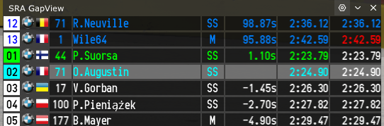
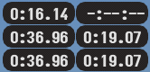

# Assetto Corsa Lua Applications

   

## [Lien Discord SRA](https://discord.gg/sPDbxeY9)

### Bienvenue dans mes applications Lua pour Assetto Corsa. 
>Ce projet vise à fournir diverses applications Lua utiles pour améliorer l'expérience de jeu sur Assetto Corsa.
>
>Il s'agit d'applications faites pour moi et que je partage librement.

## sra_tyres
**Application de statut des pneus et plus.**
<ul>

<li>Température des pneus (optimum)</li>
<li>Pression des pneus (optimum)</li>
<li>Usure des pneus</li>
<li>Charge des pneus</li>
<li>Plat des pneus</li>
<li>Graining des pneus</li>
<li>Blistering des pneus</li>
<li>Pincement des roues (ToeIn)</li>
<li>Carrossage des roues (Camber)</li>
<li>Température des disques si disponible</li>
<li>Options et zoom disponible</li>
</ul>

_* Ne fonctionne pas pour les autres voitures._

## sra_damage

**Application de statut des dégats.**
<ul>
<li>Dégat Moteur</li>
<li> Dégat Boite</li>
<li>Dégat avant / arrière</li>
<li>Dégat droit / gauche</li>
<li>Options et zoom disponible</li>
</ul>

_*Fonctionne pour les autres voitures._

## sra_minidash

**Un petit dasboard style GT.**
<ul>
<li>Un max d'infos très utilie en course</li>
<li>P2P ou DRS selon la voitur</li>
<li>Turbo si dipsonible</li>
<li>KERS et ERS si disponible</li>
<li>Options et zoom disponible</li>
</ul>

_* Certaines infos ne fonctionne pas pour les autres voitures._
 

## sra_gap

**Affiche le gap de x pilotes devant et derrière.**

<ul>
<li>Position</li>
<li>Nom du pilote</li>
<li>Meilleur tour</li>
<li>Dernier tour</li>
<li>Type de pneu</li>
<li>Gap</li>
<li>Dans les pits</li>
<li>Options et zoom disponible</li>
<li>Type de pneu</li>
</ul>

## sra_hud

**Plusieus petits affichages .**

<ul>
<li>Race info</li>
<li></li>
<li>Heure locale et du serveur</li>
<li></li>
<li>Affichage des temoins</li>
<li></li>
<li>Meilleurs tours</li>
<li></li>
<li>Secteurs</li>
<li></li>
</ul>

**Configuration globale:**

<ul>
<li>Zoom</li>
<li>Couleur de fond avec alpha</li>
<li>Couleur de texte</li>
</ul>

## Comment Utiliser

Copiez les fichiers de l'application souhaitée dans le dossier app/lua de votre installation d'Assetto Corsa.

Lancez Assetto Corsa et profitez de votre nouvelle fonctionnalité !

>Contribution
>Si vous souhaitez contribuer à ce projet, n'hésitez pas à envoyer des pull requests. 
>Toute contribution est la bienvenue !

>Problèmes et Suggestions
>Si vous rencontrez des problèmes ou avez des suggestions pour de nouvelles fonctionnalités, veuillez ouvrir un ticket ici.

